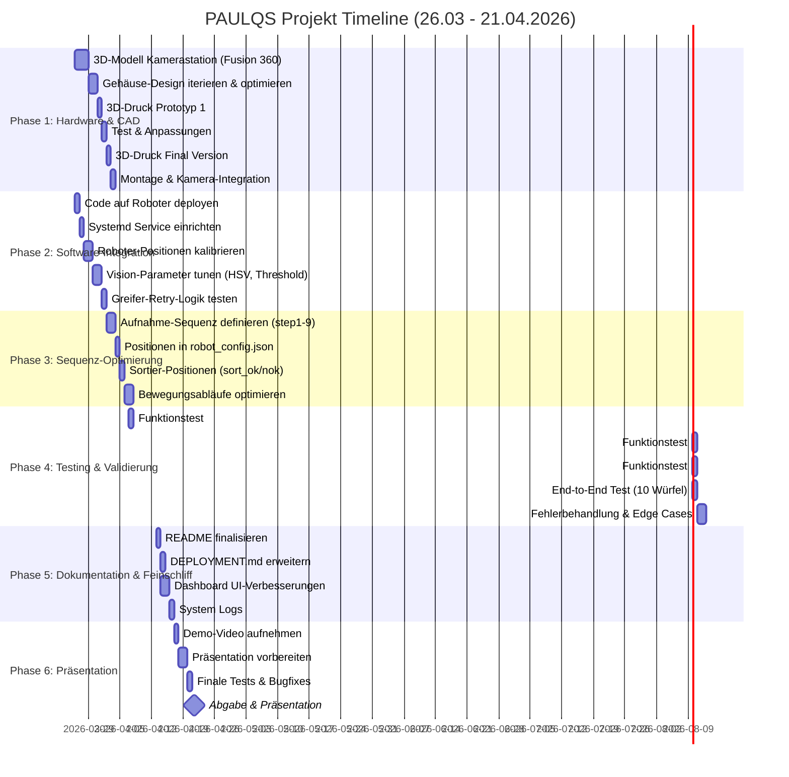
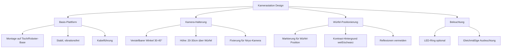
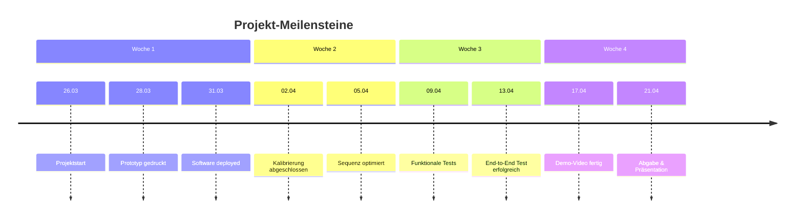

# PAULQS Cube Inspection System – Projektplan

**Zeitraum:** 26. März 2026 - 21. April 2026 (4 Wochen)  
**Projekt:** Automatisierte Würfel-Qualitätsprüfung mit Niryo-Roboter

---

## Gantt-Diagramm

---

## Wochenübersicht

### 📅 Woche 1 (26.03 - 01.04) – Hardware & Deployment

**Schwerpunkt:** 3D-Druck Kamerastation + Software auf Roboter

| Tag | Aufgabe | Dauer | Status |
|-----|---------|-------|--------|
| **Mi 26.03** | 3D-Modell Kamerastation in Fusion 360 erstellen | 6h | ⏳ |
| **Do 27.03** | Design-Iterationen & Optimierung | 4h | ⏳ |
| **Do 27.03** | Code auf Roboter deployen (SSH, pip install) | 2h | ⏳ |
| **Fr 28.03** | 3D-Druck Prototyp starten | 8h | ⏳ |
| **Sa 29.03** | Prototyp testen, Anpassungen im CAD | 4h | ⏳ |
| **So 30.03** | 3D-Druck Final Version | 8h | ⏳ |
| **Mo 31.03** | Montage, Kamera einbauen & testen | 4h | ⏳ |
| **Mo 31.03** | Systemd Service einrichten (Auto-Start) | 2h | ⏳ |

**Deliverables:**
- ✅ Fertige Kamerastation (3D-gedruckt, montiert)
- ✅ Software läuft auf Roboter, startet automatisch
- ✅ Dashboard erreichbar unter `http://10.10.10.10:8000/dashboard/`

---

### 📅 Woche 2 (02.04 - 08.04) – Kalibrierung & Sequenz

**Schwerpunkt:** Roboter-Positionen kalibrieren, Sequenz optimieren

| Tag | Aufgabe | Dauer | Status |
|-----|---------|-------|--------|
| **Di 01.04** | Roboter-Positionen kalibrieren (Teach-Mode) | 4h | ⏳ |
| **Di 01.04** | Vision-Parameter tunen (HSV-Werte, Threshold) | 3h | ⏳ |
| **Mi 02.04** | Greifer-Retry-Logik testen (3 Versuche) | 2h | ⏳ |
| **Mi 02.04** | Aufnahme-Sequenz definieren (step1-9) | 4h | ⏳ |
| **Do 03.04** | Positionen in `robot_config.json` eintragen | 3h | ⏳ |
| **Fr 04.04** | Sortier-Positionen (sort_ok, sort_nok) kalibrieren | 3h | ⏳ |
| **Sa 05.04** | Bewegungsabläufe optimieren (Geschwindigkeit, Sicherheit) | 4h | ⏳ |
| **So 06.04** | Puffer / Reserve | - | ⏳ |

**Deliverables:**
- ✅ `robot_config.json` mit allen Positionen
- ✅ Würfel wird zuverlässig gegriffen (Retry funktioniert)
- ✅ Bilder sind scharf und Würfel gut erkennbar

---

### 📅 Woche 3 (09.04 - 15.04) – Testing & Dokumentation

**Schwerpunkt:** Funktionale Tests, End-to-End, Doku

| Tag | Aufgabe | Dauer | Status |
|-----|---------|-------|--------|
| **Mi 09.04** | Funktionstest: Greifen & Positionieren | 3h | ⏳ |
| **Do 10.04** | Funktionstest: Bildaufnahme & Erkennung | 3h | ⏳ |
| **Fr 11.04** | Funktionstest: Sortierung (OK/NOK Kisten) | 3h | ⏳ |
| **Sa 12.04** | End-to-End Test (10 Würfel durchlaufen lassen) | 4h | ⏳ |
| **So 13.04** | Fehlerbehandlung & Edge Cases (kein Würfel, falsche Position) | 4h | ⏳ |
| **Mo 14.04** | README finalisieren (alle Features dokumentiert) | 3h | ⏳ |
| **Di 15.04** | DEPLOYMENT.md erweitern (Troubleshooting) | 2h | ⏳ |

**Deliverables:**
- ✅ System läuft stabil (10 Würfel ohne Fehler)
- ✅ Fehlerbehandlung funktioniert
- ✅ Dokumentation vollständig

---

### 📅 Woche 4 (16.04 - 21.04) – Feinschliff & Präsentation

**Schwerpunkt:** UI-Verbesserungen, Demo-Video, Präsentation

| Tag | Aufgabe | Dauer | Status |
|-----|---------|-------|--------|
| **Mi 16.04** | Dashboard UI-Verbesserungen (Responsive, UX) | 4h | ⏳ |
| **Do 17.04** | System Logs: Filter-Performance optimieren | 2h | ⏳ |
| **Do 17.04** | Demo-Video aufnehmen (3-5 Min) | 3h | ⏳ |
| **Fr 18.04** | Präsentation vorbereiten (Slides, Ablauf) | 4h | ⏳ |
| **Sa 19.04** | Präsentation üben & verfeinern | 3h | ⏳ |
| **So 20.04** | Finale Tests & letzte Bugfixes | 4h | ⏳ |
| **Mo 21.04** | **🎯 Abgabe & Präsentation** | - | ⏳ |

**Deliverables:**
- ✅ Demo-Video (zeigt kompletten Ablauf)
- ✅ Präsentation fertig
- ✅ System produktionsreif

---

## 3D-Druck Kamerastation – CAD-Anforderungen

### Design-Spezifikationen

### CAD-Workflow (Fusion 360)

**Tag 1 (26.03):**
1. **Skizze erstellen** – Grundriss der Basis (200x200mm)
2. **Extrusion** – Basis-Plattform (10mm dick)
3. **Kamera-Arm modellieren** – Verstellbarer Winkel
4. **Halterung für Niryo-Kamera** – Maße von Kamera-Datenblatt
5. **Würfel-Positionierungs-Marker** – Zentriert auf Plattform

**Tag 2 (27.03):**
6. **Kabelführung** – Kanäle für Kamera-Kabel
7. **Montage-Löcher** – M4 Schrauben für Tisch-Befestigung
8. **Optimierung** – Gewicht reduzieren, Material sparen
9. **STL exportieren** – Für 3D-Druck vorbereiten

### 3D-Druck Parameter

| Parameter | Wert |
|-----------|------|
| **Material** | PLA oder PETG |
| **Layer Height** | 0.2mm |
| **Infill** | 20% (Basis), 40% (Kamera-Arm) |
| **Support** | Ja (für Kamera-Arm) |
| **Druckzeit** | ~6-8h (Prototyp), ~8-10h (Final) |
| **Farbe** | Schwarz (reduziert Reflexionen) |

---

## Meilensteine & Checkpoints

---

## Risiken & Mitigation

| Risiko | Wahrscheinlichkeit | Impact | Mitigation |
|--------|-------------------|--------|------------|
| 3D-Druck fehlgeschlagen | Mittel | Hoch | Prototyp früh drucken, Reserve-Zeit |
| Roboter-Positionen ungenau | Hoch | Mittel | Mehrfach kalibrieren, Teach-Mode nutzen |
| Vision-Erkennung unzuverlässig | Mittel | Hoch | HSV-Werte iterativ tunen, Beleuchtung |
| Greifer greift nicht | Mittel | Hoch | Retry-Logik (bereits implementiert) |
| Zeitverzug | Mittel | Mittel | Puffer-Tage eingeplant (06.04, 20.04) |

---

## Erfolgs-Kriterien

✅ **Technisch:**
- System erkennt Würfel mit >95% Genauigkeit
- Greifer greift Würfel in <3 Versuchen
- Sortierung funktioniert zuverlässig (OK/NOK)
- Dashboard zeigt alle Logs & Metriken

✅ **Hardware:**
- Kamerastation stabil und funktional
- Kamera liefert scharfe Bilder
- Beleuchtung gleichmäßig

✅ **Dokumentation:**
- README vollständig
- DEPLOYMENT.md mit Troubleshooting
- Code gut kommentiert

✅ **Präsentation:**
- Demo-Video zeigt kompletten Ablauf
- Präsentation überzeugend
- Live-Demo funktioniert

---

## Nächste Schritte (ab 26.03)

1. **Fusion 360 öffnen** → Kamerastation-Design starten
2. **SSH zum Roboter** → Software deployen
3. **Projektplan ausdrucken** → An Wand hängen für Überblick

**Viel Erfolg! 🚀**
