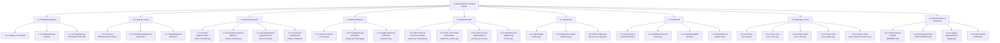

# Projektstrukturplan (PSP) – PAULQS Cube Inspection System

```mermaid
graph TD
    ROOT["1 Automatisierter Prüfstand<br/>Würfel"]

    ROOT --> PM["1.1 Projektmanagement"]
    ROOT --> HW["1.2 Hardware-Setup"]
    ROOT --> RI["1.3 Roboterintegration"]
    ROOT --> BV["1.4 Bildverarbeitung"]
    ROOT --> BA["1.5 Backend & API"]
    ROOT --> DB["1.6 Datenbank"]
    ROOT --> DA["1.7 Dashboard"]
    ROOT --> IT["1.8 Integration & Test"]
    ROOT --> DOK["1.9 Dokumentation &<br/>Abschluss"]

    %% 1.1 Projektmanagement
    PM --> PM1["1.1.1 Analyse Ist-/Zustand"]
    PM --> PM2["1.1.2 Systemkonzept<br/>erstellen"]
    PM --> PM3["1.1.3 Projektplanung<br/>(PROJEKTPLAN.md)"]

    %% 1.2 Hardware-Setup
    HW --> HW1["1.2.1 Kamera &<br/>Beleuchtung montieren"]
    HW --> HW2["1.2.2 Roboterarbeitsbereich<br/>vorbereiten"]
    HW --> HW3["1.2.3 Übergabepunkt<br/>definieren"]

    %% 1.3 Roboterintegration (infrastructure/robot/)
    RI --> RI1["1.3.1 Greifen<br/>implementieren<br/>(robot_controller.py)"]
    RI --> RI2["1.3.2 Inspektionssequenz<br/>abfahren<br/>(robot_controller.py)"]
    RI --> RI3["1.3.3 Sortierpositionen<br/>programmieren<br/>(movements.py)"]
    RI --> RI4["1.3.4 Positionen<br/>konfigurieren<br/>(robot_config.json)"]

    %% 1.4 Bildverarbeitung (infrastructure/vision/)
    BV --> BV1["1.4.1 Kamera-Capture<br/>(camera.py)"]
    BV --> BV2["1.4.2 Farberkennung<br/>entwickeln<br/>(image_processing.py)"]
    BV --> BV3["1.4.3 Augenerkennung<br/>entwickeln<br/>(detection.py)"]

    %% 1.5 Backend & API (api/ + application/)
    BA --> BA1["1.5.1 API-Routen &<br/>Schemas erstellen<br/>(routes.py, schemas.py)"]
    BA --> BA2["1.5.2 SOLL-/IST-Daten<br/>bereitstellen<br/>(inspection_service.py)"]
    BA --> BA3["1.5.3 Sortier-Service<br/>implementieren<br/>(sorting_service.py)"]
    BA --> BA4["1.5.4 Healthcheck &<br/>Kalibrierung<br/>(routes.py)"]

    %% 1.6 Datenbank (infrastructure/database/)
    DB --> DB1["1.6.1 DB-Modelle<br/>(models.py)"]
    DB --> DB2["1.6.2 Repository-Pattern<br/>(repository.py)"]
    DB --> DB3["1.6.3 DB-Konfiguration<br/>(db.py, db_config.json)"]

    %% 1.7 Dashboard (dashboard/)
    DA --> DA1["1.7.1 Dashboard-UI<br/>(dashboard.html)"]
    DA --> DA2["1.7.2 Dashboard-Routen<br/>(routes.py)"]
    DA --> DA3["1.7.3 Inspektionsbilder<br/>anzeigen"]
    DA --> DA4["1.7.4 DB-Explorer &<br/>System-Logs"]

    %% 1.8 Integration & Test (tests/)
    IT --> IT1["1.8.1 API-Tests<br/>(test_api.py)"]
    IT --> IT2["1.8.2 Vision-Tests<br/>(test_vision.py)"]
    IT --> IT3["1.8.3 Roboter-Tests<br/>(test_robot.py)"]
    IT --> IT4["1.8.4 Greifer-Tests<br/>(test_gripper.py)"]
    IT --> IT5["1.8.5 Kamera-Tests<br/>(test_cameraConnection.py)"]

    %% 1.9 Dokumentation & Abschluss
    DOK --> DOK1["1.9.1 Dokumentation<br/>erstellen<br/>(README.md)"]
    DOK --> DOK2["1.9.2 Deployment-Doku<br/>(DEPLOYMENT.md)"]
    DOK --> DOK3["1.9.3 Logging<br/>implementieren<br/>(logger.py)"]
    DOK --> DOK4["1.9.4 Präsentation<br/>vorbereiten"]
```
