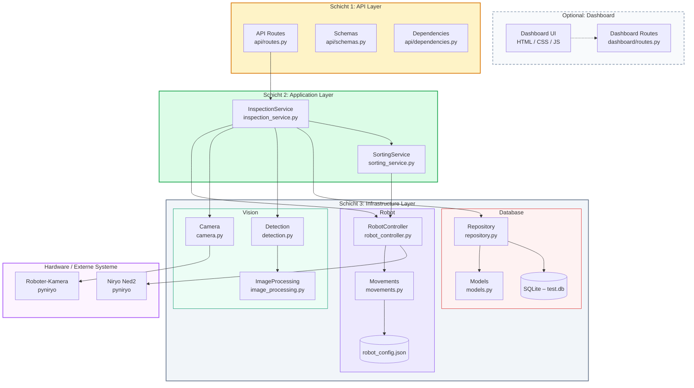

```mermaid
flowchart TB

    subgraph L1["Optional: Dashboard"]
        direction LR
        DASH["Dashboard UI<br/>HTML / CSS / JS"]
        DASHR["Dashboard Routes<br/>dashboard/routes.py"]
    end

    subgraph L2["Schicht 1: API Layer"]
        direction LR
        ROUTES["API Routes<br/>api/routes.py"]
        SCHEMAS["Schemas<br/>api/schemas.py"]
        DEPS["Dependencies<br/>api/dependencies.py"]
    end

    subgraph L3["Schicht 2: Application Layer"]
        direction LR
        IS["InspectionService<br/>inspection_service.py"]
        SS["SortingService<br/>sorting_service.py"]
    end

    subgraph L4["Schicht 3: Infrastructure Layer"]
        direction LR
        subgraph L4R["Robot"]
            direction TB
            CTRL["RobotController<br/>robot_controller.py"]
            MOV["Movements<br/>movements.py"]
            CFG[("robot_config.json")]
        end
        subgraph L4V["Vision"]
            direction TB
            CAM["Camera<br/>camera.py"]
            DET["Detection<br/>detection.py"]
            IMG["ImageProcessing<br/>image_processing.py"]
        end
        subgraph L4D["Database"]
            direction TB
            REPO["Repository<br/>repository.py"]
            MODELS["Models<br/>models.py"]
            DBE[("SQLite – test.db")]
        end
    end

    subgraph L5["Hardware / Externe Systeme"]
        direction LR
        NED["Niryo Ned2<br/>pyniryo"]
        HWCAM["Roboter-Kamera<br/>pyniryo"]
    end

    %% Schicht 1 → 2: API
    DASH -.-> DASHR
    ROUTES --> IS

    %% Schicht 2 → 3: Application → Infrastructure
    IS --> CTRL
    IS --> CAM
    IS --> DET
    IS --> REPO
    IS --> SS
    SS --> CTRL

    %% Schicht 3 intern: Infrastructure
    CTRL --> MOV
    MOV --> CFG
    DET --> IMG
    REPO --> MODELS
    REPO --> DBE

    %% Schicht 3 → 4: Hardware
    CTRL --> NED
    CAM --> HWCAM

    %% Styles – Schichten
    style L1 fill:#f8fafc,stroke:#94a3b8,stroke-width:2px,stroke-dasharray: 6 4
    style L2 fill:#fef3c7,stroke:#d97706,stroke-width:2px
    style L3 fill:#dcfce7,stroke:#16a34a,stroke-width:2px
    style L4 fill:#f1f5f9,stroke:#64748b,stroke-width:2px
    style L5 fill:#fdf4ff,stroke:#a855f7,stroke-width:2px

    %% Styles – Unterschichten
    style L4R fill:#ede9fe,stroke:#7c3aed,stroke-width:1px
    style L4V fill:#ecfdf5,stroke:#059669,stroke-width:1px
    style L4D fill:#fef2f2,stroke:#dc2626,stroke-width:1px
```
