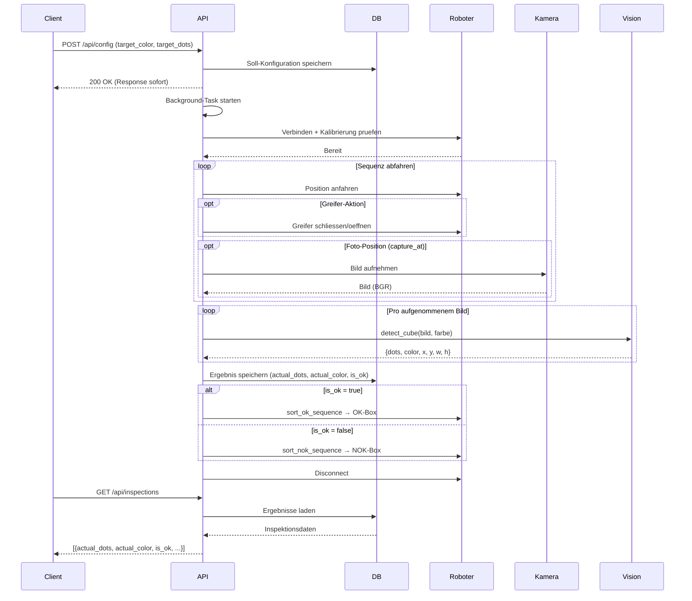

# PAULQS – Kundendokumentation

**Cube Inspection System – Automatisierte Wuerfel-Qualitaetspruefung**

---

## Inhaltsverzeichnis

1. [Was macht das System?](#1-was-macht-das-system)
2. [Installation und Start](#2-installation-und-start)
3. [API-Nutzung](#3-api-nutzung)
4. [Inspektionsablauf](#4-inspektionsablauf)
5. [Konfiguration](#5-konfiguration)
6. [Bildverarbeitung](#6-bildverarbeitung)
7. [Datenbank](#7-datenbank)
8. [Dashboard](#8-dashboard)
9. [Sicherheitssystem](#9-sicherheitssystem)
10. [Troubleshooting](#10-troubleshooting)

---

## 1. Was macht das System?

Das PAULQS Cube Inspection System prueft Wuerfel automatisch auf Korrektheit. Ein **Niryo Ned2 Roboterarm** greift einen Wuerfel, faehrt ihn in ein **3D-gedrucktes Kameragehaeuse** (Fotobox mit LED-Beleuchtung), dort wird er fotografiert und per **Computer Vision** analysiert. Anschliessend sortiert der Roboter den Wuerfel – korrekte in die OK-Box, fehlerhafte in die NOK-Box.

**Kurzablauf:**
1. Soll-Konfiguration per API senden (Farbe + erwartete Augenzahlen)
2. Roboter greift Wuerfel und faehrt in die Fotobox
3. Kamera im Gehaeuse fotografiert den Wuerfel
4. Bildverarbeitung erkennt Farbe und Augenzahl
5. Soll/Ist-Vergleich → OK oder NOK
6. Roboter sortiert den Wuerfel in die entsprechende Box

---

## 2. Installation und Start

### Voraussetzungen

- Python 3.12+
- Niryo Ned2 im Netzwerk (Standard-IP: `10.10.10.10`)
- Kamera im 3D-gedruckten Gehaeuse angeschlossen

### Installation

```bash
cd cube-inspection-system
pip install -r requirements.txt
```

### Server starten

```bash
python -m uvicorn app.main:app --host 0.0.0.0 --port 8000 --reload
```

Danach erreichbar:

| Dienst | URL |
|--------|-----|
| API | `http://localhost:8000` |
| Swagger-Doku | `http://localhost:8000/docs` |
| Dashboard | `http://localhost:8000/dashboard/` |

Die SQLite-Datenbank (`PaulQS.db`) wird beim ersten Start automatisch erstellt.

---

## 3. API-Nutzung

### 3.1 Endpunkt-Uebersicht

| Methode | Pfad | Beschreibung |
|---------|------|-------------|
| `GET` | `/` | Systemstatus |
| `POST` | `/api/config` | **Inspektion starten** (Soll-Werte senden) |
| `GET` | `/api/inspections` | Pruefergebnisse abrufen |
| `GET` | `/api/healthcheck` | System-Gesundheit pruefen |
| `POST` | `/api/calibration` | Roboter kalibrieren |
| `POST` | `/api/learning-mode` | Learning Mode ein/aus |
| `GET` | `/api/current-joints` | Aktuelle Gelenkpositionen |

### 3.2 Inspektion starten – `POST /api/config`

Das ist der **Haupt-Endpunkt**. Er empfaengt die Soll-Konfiguration und startet die komplette Inspektion im Hintergrund.

**Request:**

```bash
curl -X POST http://localhost:8000/api/config \
  -H "Content-Type: application/json" \
  -d '{
    "target_color": "orange",
    "target_dots": [1, 3, 5]
  }'
```

| Feld | Typ | Beschreibung |
|------|-----|-------------|
| `target_color` | String | Soll-Farbe des Wuerfels |
| `target_dots` | Array[int] | Erwartete Augenzahlen (z.B. `[1, 3, 5]`) |

**Verfuegbare Farben:** `orange`, `rot`, `gelb`, `gruen`, `blau`, `lila`

**Verhalten:** Die Response kommt sofort zurueck – die eigentliche Inspektion laeuft im Hintergrund. Ergebnisse danach ueber `GET /api/inspections` abrufbar.

### 3.3 Ergebnisse abrufen – `GET /api/inspections`

```bash
curl http://localhost:8000/api/inspections?limit=5
```

**Response:**

```json
[
  {
    "id": 1,
    "config_id": 1,
    "timestamp": "2026-04-15T14:30:00",
    "actual_color": "orange",
    "actual_dots": [5, 1, 3],
    "confidence": null,
    "is_ok": true
  }
]
```

- `actual_dots` – tatsaechlich erkannte Augenzahlen
- `actual_color` – erkannte Wuerfelfarbe
- `is_ok` – `true` wenn Augenzahlen UND Farbe mit Soll uebereinstimmen

### 3.4 Healthcheck – `GET /api/healthcheck`

```json
{
  "status": "healthy",
  "components": {
    "robot_connected": true,
    "robot_calibrated": true,
    "camera_connected": true
  }
}
```

### 3.5 Kalibrierung – `POST /api/calibration`

Fuehrt eine Auto-Kalibrierung des Roboters durch. Muss nach einem Neustart des Roboters ausgefuehrt werden.

### 3.6 Learning Mode – `POST /api/learning-mode`

Aktiviert/deaktiviert den Freedrive-Modus, um den Roboter von Hand zu fuehren.

```bash
curl -X POST http://localhost:8000/api/learning-mode \
  -H "Content-Type: application/json" \
  -d '{"enabled": true}'
```

### 3.7 Gelenkpositionen – `GET /api/current-joints`

Gibt die aktuellen 6 Gelenkwinkel zurueck. Nuetzlich zum Aufnehmen neuer Positionen.

```json
{ "status": "success", "joints": [-0.4086, -0.0217, -0.6749, 0.0906, -0.8469, -0.4524] }
```

---

## 4. Inspektionsablauf

Nach `POST /api/config` laeuft folgender Ablauf automatisch ab:

```
  API empfaengt Soll-Konfiguration → speichert in DB
       │
       ▼
  Roboter verbinden + Kalibrierung pruefen
       │
       ▼
  Roboter-Sequenz abfahren:
    1. Ueber Wuerfel fahren
    2. Wuerfel greifen
    3. Wuerfel anheben + drehen
    4. In das Kameragehaeuse einfahren
    5. Foto Seite 1 aufnehmen
    6. Wuerfel rotieren + Foto Seite 2
    7. Kameragehaeuse verlassen
    8. Home-Position
       │
       ▼
  Bildanalyse: Farbe erkennen + Augen zaehlen
       │
       ▼
  Soll/Ist-Vergleich: Augen + Farbe pruefen → OK oder NOK
       │
       ▼
  Sortierung: OK → OK-Box, NOK → NOK-Box
```

Der Vergleich prueft **Augenzahlen** (reihenfolge-unabhaengig) **und Farbe**. Beides muss stimmen, damit `is_ok = true`.

### Sequenzdiagramm



---

## 5. Konfiguration

### 5.1 Roboter-Konfiguration (`robot_config.json`)

**Pfad:** `app/infrastructure/robot/robot_config.json`

Zentrale Datei fuer alle Roboter-Einstellungen. Aenderungen hier erfordern **keinen Code-Eingriff**.

**Wichtigste Parameter:**

| Parameter | Beschreibung |
|-----------|-------------|
| `robot_ip` | IP des Niryo (Standard: `10.10.10.10`, lokal: `127.0.0.1`) |
| `gripper_speed` | Greifer-Geschwindigkeit (0–1000) |
| `positions` | Benannte Positionen mit je 6 Gelenkwinkeln (Radiant) |
| `sequence` | Reihenfolge der Inspektions-Positionen |
| `gripper_close_at` | Bei welchem Step der Greifer schliesst |
| `gripper_open_at` | Bei welchem Step der Greifer oeffnet |
| `capture_at` | Bei welchen Steps die Kamera ein Foto macht |
| `sort_ok_sequence` | Fahrweg zur OK-Box |
| `sort_nok_sequence` | Fahrweg zur NOK-Box |
| `safety` | Sicherheitsparameter (siehe Kapitel 9) |

**Neue Positionen aufnehmen:**
1. Learning Mode aktivieren (`POST /api/learning-mode`)
2. Roboter von Hand in Position bringen
3. Gelenkwerte auslesen (`GET /api/current-joints`)
4. Werte in `robot_config.json` unter `positions` eintragen

### 5.2 Datenbank-Konfiguration (`db_config.json`)

**Pfad:** `app/infrastructure/database/db_config.json`

```json
{
  "database_url": "sqlite:///./PaulQS.db",
  "check_same_thread": false
}
```

Fuer Deployment auf dem Roboter den Pfad auf absolut aendern:

```json
{
  "database_url": "sqlite:////home/niryo/PAULQS/cube-inspection-system/PaulQS.db",
  "check_same_thread": false
}
```

---

## 6. Bildverarbeitung

### 6.1 Wie funktioniert die Erkennung?

Die Kamera sitzt fest im 3D-gedruckten Gehaeuse (weisse Fotobox mit LED-Ring-Beleuchtung). Der Roboter faehrt den Wuerfel in dieses Gehaeuse hinein, wo er unter kontrollierten Lichtverhaeltnissen fotografiert wird.

Die Bildverarbeitung laeuft in drei Schritten:

**Schritt 1 – Wuerfel finden:**
- Bild wird in den HSV-Farbraum konvertiert
- Farbmaske erstellt (z.B. alle orangefarbenen Pixel)
- Morphologie-Operationen entfernen Rauschen
- Groesste Kontur = Wuerfelfläche

**Schritt 2 – Augen zaehlen:**
- Konturen mit Hierarchie finden (`RETR_CCOMP`)
- Aeussere Kontur = Wuerfelfläche, innere Konturen (Loecher) = Augen
- Filter: Fläche (30–800 px²), Rundheit (> 0.45), Ausreisser-Entfernung

**Schritt 3 – Farbe bestimmen:**
- Median-Hue aller farbigen Pixel im Wuerfel-ROI berechnen
- Gegen die Farb-Tabelle matchen

### 6.2 Unterstuetzte Farben

| Farbe | Hue-Bereich |
|-------|-------------|
| Orange | 5–25 |
| Rot | 0–10 + 160–180 |
| Gelb | 20–35 |
| Gruen | 35–85 |
| Blau | 100–130 |
| Lila | 125–155 |

**Weiss** ist definiert, aber mit der weissen Fotobox nicht nutzbar.

### 6.3 Auto-Modus und Fallback

- **Auto-Modus**: Alle Farben werden durchprobiert, die mit der groessten Wuerfelfläche gewinnt.
- **Fallback**: Falls die Loch-Methode 0 Augen findet (z.B. bei geprägten Wuerfeln), sucht das System per adaptivem Threshold nach dunklen Stellen im Graustufenbild.

### 6.4 Gespeicherte Bilder

Pro Inspektion werden Bilder unter `app/infrastructure/vision/captures/` abgelegt:

| Datei | Inhalt |
|-------|--------|
| `side_X_raw.jpg` | Rohbild |
| `side_X_result.jpg` | Ergebnis mit Bounding-Box + Augenzahl |

---

## 7. Datenbank

SQLite-Datenbank (`PaulQS.db`), wird automatisch erstellt. Drei Tabellen:

### `configurations` – Soll-Werte

| Spalte | Typ | Beschreibung |
|--------|-----|-------------|
| `id` | Integer (PK) | Auto-Inkrement |
| `target_color` | String | Soll-Farbe des Wuerfels |
| `target_dots` | String (JSON) | z.B. `"[1, 3, 5]"` |
| `created_at` | DateTime | Erstellzeitpunkt |

### `inspections` – Pruefergebnisse

| Spalte | Typ | Beschreibung |
|--------|-----|-------------|
| `id` | Integer (PK) | Auto-Inkrement |
| `config_id` | Integer (FK) | Verweis auf `configurations` |
| `timestamp` | DateTime | Pruefzeitpunkt |
| `actual_color` | String | Erkannte Farbe |
| `actual_dots` | String (JSON) | Erkannte Augenzahlen |
| `is_ok` | Boolean | Augen + Farbe korrekt? |

### `system_logs` – Protokoll

| Spalte | Typ | Beschreibung |
|--------|-----|-------------|
| `module` | String | ROBOT, VISION, INSPECTION, SORTING, API |
| `level` | String | INFO, WARNING, ERROR |
| `message` | String | Log-Nachricht |
| `timestamp` | DateTime | Zeitpunkt |

Logs werden automatisch nach 30 Tagen geloescht (Log-Rotation).

---

## 8. Dashboard

Erreichbar unter `http://<server-ip>:8000/dashboard/`

- **Healthcheck** – Roboter, Kalibrierung, Kamera Status
- **Letzte Inspektion** – Soll/Ist-Vergleich mit Bildern
- **Robot-Config Editor** – Positionen und Sequenzen im Browser bearbeiten
- **System Logs** – Filterbarer Log-Viewer (Modul, Level, Freitext)
- **Datenbank-Explorer** – Tabellen einsehen, Eintraege loeschen

---

## 9. Sicherheitssystem

Das Safety-System prueft nach jeder Roboterbewegung:

- **Kollisionserkennung** – Hat der Roboter ein Hindernis beruehrt?
- **Grip-Check** – Haelt der Greifer noch den Wuerfel?

Bei einem Problem wird ein **Notfall-Stopp** ausgeloest:
- Greifer oeffnet sich
- LED-Ring leuchtet rot
- Motoren bleiben aktiv (Arm faellt nicht herunter)

Nach einem Notfall-Stopp muss der Roboter manuell (z.B. ueber Niryo Studio) in eine sichere Position gebracht werden.

**Safety-Parameter** in `robot_config.json` unter `safety`:

| Parameter | Default | Beschreibung |
|-----------|---------|-------------|
| `enabled` | `true` | Safety ein/aus |
| `grip_loss_threshold` | `0.005` | Schwellwert fuer Grip-Verlust (rad) |
| `gripper_max_torque_percentage` | `100` | Maximale Greiferkraft (%) |
| `led_error_color` | `[255,0,0]` | LED-Farbe bei Notfall (Rot) |
| `led_ok_color` | `[0,255,0]` | LED-Farbe bei Erfolg (Gruen) |
| `capture_wait_sec` | `3` | Wartezeit vor Foto (Stabilisierung) |

**Tuning:** Bei Fehlalarmen `grip_loss_threshold` erhoehen (z.B. `0.01`), zum Testen Safety mit `"enabled": false` deaktivieren.

---

## 10. Troubleshooting

| Problem | Loesung |
|---------|---------|
| Roboter nicht erreichbar | `ping 10.10.10.10`, IP in `robot_config.json` pruefen |
| Kamera liefert kein Bild | Kabel pruefen, Roboter neu starten |
| Kalibrierung noetig | `POST /api/calibration` ausfuehren |
| Augenzahl falsch erkannt | LED-Beleuchtung pruefen, Fotobox-Hintergrund sauber? |
| ModuleNotFoundError | `pip install -r requirements.txt` ausfuehren |
| Notfall-Stopp (LED rot) | Roboter manuell via Niryo Studio in sichere Position bringen |
| DB-Fehler | Verzeichnis-Rechte pruefen, DB-Pfad in `db_config.json` kontrollieren |
